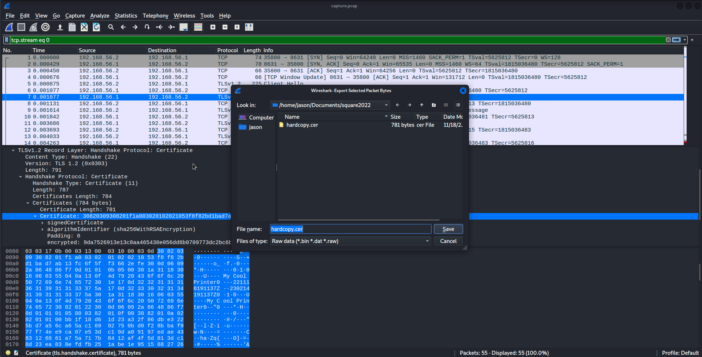
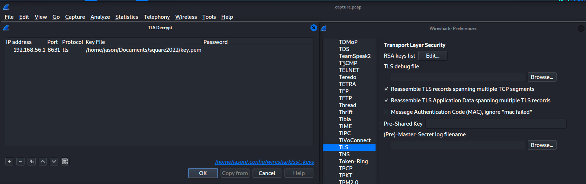
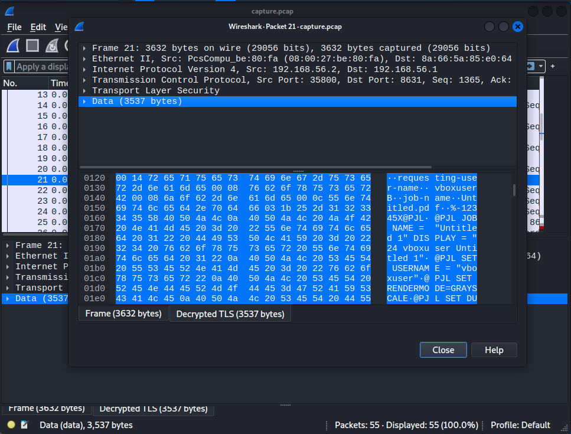

# Challenge: Hard Copy
## Description
I printed a hard copy of the flag, but then I lost it. Will you help me recover it?
* Category: crypto/rev
* Points: 300
## Comments
This challenge is more forensics than anything else. It's a good demonstration of how an improper crypto implementation allows an attacker to intercept and decrypt traffic using Wireshark. The official writeup does a good job as well (go [read it](https://squarectf.com/2022/hardcopy.html)).
## My Solution
### Crypto/Rev Portion
Everything in printer.go is pretty innocuous except for the RSA implementation. I wasn't familiar with Golang before this challenge, so I had to use the [docs](https://pkg.go.dev/math/big#Int) to figure out what was happening.

Here's the translation into Python:
```py
import Crypto.Util.number as cun
p = cun.getPrime(1024)
q = p^(1<<1021) # xor
while(not cun.isPrime(q)):
  if q < p:
    q -= 2
  elif q > p:
    q += 2
n=p*q
```

Since we know that the difference between p and q is slightly more than $2^{1021}$, we can essentially just solve a quadratic.

Let $r = \min(p,q)$ and $k = 2^{1021}.$ Then, $r(r+k) = n$ gives $\left(r+\frac k2\right)^2 = n + \left(\frac k2\right)^2$, so $r \approx \sqrt{n+\frac{k^2}{4}}-\frac k2$.

Here's the Python for it:
```py
import math

n=0xBB1F18D61D23A32F86DBE3225BD7A56CA65AC16992750BD0F28BBAF977F74EE9CA07E53DC19DA09197EDAE4383126861A75A717B8412AF4F5D813DC18D23EA838EFDFB251ABE1E9515882726D2C18CCB68B981051D9360D3DB5679A608A6087A19C767E665046506F878C404431830FE9B492C4443F58B35C2678808D2DC21FBBE6936DBF50FDC4B50066B31855734E9082B162B915B131E7EA7106101E377AE3B2DD76E481D4B40D0C6158AC7CFE73362D6C87A48F37B57781CD71E19DEB6078DB42D2B59ACFEC79C7FB30DA67039F2B2E98DD11EE4ECB5581050F1F98A51966F42EB1CA01532738698D3492DD46FA851E9CFED3343A232C45652AA7063B13B
k = 1<<1021
r=math.isqrt(n+k**2//4) - k//2
while(n % r != 0):
    r -= 1
p = r
q = n//r
print(p, q, p*q == n)
```

Yea there wasn't really any crypto here... didn't even need SageMath.
### Forensics Portion
The forensics part was more fun.

We need to recover the modulus from the PCAP. To do this, we open capture.pcap in Wireshark and find the packet where the TLS handshake occurs.



Extracting the certifcate into a [.cer file](./hardcopy.cer), we can use openssl to read the details of the certificate: `openssl x509 -inform der -in hardcopy.cer -text`

We only care about the modulus, which we can easily recover with `openssl x509 -inform der -in hardcopy.cer -modulus`

```
Modulus=BB1F18D61D23A32F86DBE3225BD7A56CA65AC16992750BD0F28BBAF977F74EE9CA07E53DC19DA09197EDAE4383126861A75A717B8412AF4F5D813DC18D23EA838EFDFB251ABE1E9515882726D2C18CCB68B981051D9360D3DB5679A608A6087A19C767E665046506F878C404431830FE9B492C4443F58B35C2678808D2DC21FBBE6936DBF50FDC4B50066B31855734E9082B162B915B131E7EA7106101E377AE3B2DD76E481D4B40D0C6158AC7CFE73362D6C87A48F37B57781CD71E19DEB6078DB42D2B59ACFEC79C7FB30DA67039F2B2E98DD11EE4ECB5581050F1F98A51966F42EB1CA01532738698D3492DD46FA851E9CFED3343A232C45652AA7063B13B
```

Using our above script to factor the modulus, we can then create a private key. I simply modified the parameters within printer.go to create key.pem for me (script in [keygen.go](./keygen.go)).

We can then import [key.pem](./key.pem) into Wireshark.



Now that we can read the packets, we can tell that the TLS packets from packet 21 to packet 38 contain the contents of Untitled.pdf.



Extracting the bytes and concatenating, we can recover the pdf, which contains the flag: `flag{f3rMat_For_NAu9hT_2563076}`
